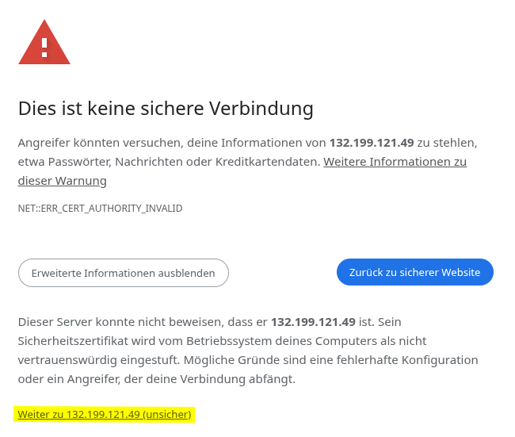
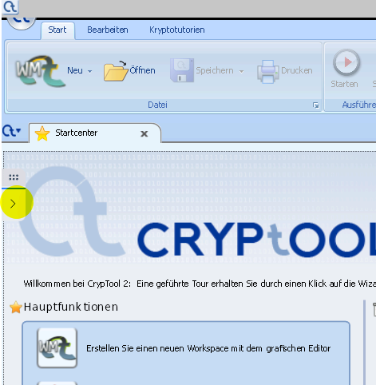

### Diese Anleitung richtet sich an alle, auf deren Geräten die Cryptool-sh Installation nicht funktioniert (Chromebooks, ARM-Prozessoren, etc.)

# Verbindung zum Server aufbauen

- In die Adressleiste des Browsers https://132.199.121.49/ : [Link zum Server](https://132.199.121.49/) eingeben
- Eventuell auftretende Sicherheitswarung umgehen, durch Aufruf des Buttons erweiterte Optionen
- Danach die gelb markierte Schaltfläche bestätigen.

> [!TIP] Falls ihr die Website keine Daten sendet: Überprüfen ob Adresse mit "https://" beginnt.

# Beim Server anmelden

```
Benutzer: Nach Git hochladen

Passwort: Nach Git hochladen
```

# Eigene Session starten

-  Button in der Mitte "Cryptool 2" auswählen
-  Starten und kurz warten

# Dateien importieren


- Markierten Pfeil anklicken um Menu zu öffnen
- Hochladen auswählen und Dateien auswählen 
- Danach in Cryptool öffnen wählen 
- Den Ordner Uploads auswählen 

# Dateien exportieren
- In Cryptool speichern wählen
- Die Datei im Ordner Downloads speichern
- [Kasm Menu öffnen](Bilder/importiere_datei.png)
- Markierten Pfeil anklicken um Menu zu öffnen
- Hier Herunterladen auswählen